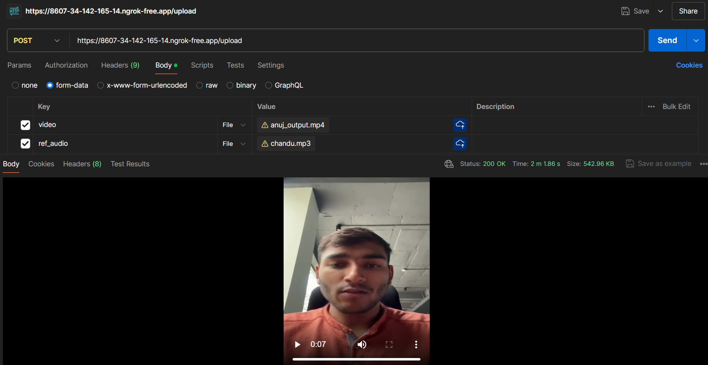

# Video Translation with Lip-Sync

This project provides a web service to translate any video into any language with lip-sync. It uses the Wav2Lip model for lip-syncing, Whisper for speech recognition, NLLB-200 for translation, and a TTS model for speech synthesis.

## Features

- Extracts audio from a video file.
- Transcribes the extracted audio using Whisper.
- Translates the transcribed text using the NLLB-200 model.
- Converts the translated text to speech using TTS.
- Syncs the generated speech with the original video using Wav2Lip.

## Requirements

- Google Colab environment
- `pip` package manager

## Installation

1. Clone the repository:
    ```bash
    git clone https://github.com/Rudrabha/Wav2Lip.git
    cd Wav2Lip
    ```

2. Install the required packages:
    ```bash
    pip install flask pyngrok
    pip install -r requirements.txt
    pip install librosa moviepy gdown transformers TTS
    pip install git+https://github.com/openai/whisper.git
    pip install --upgrade --no-deps --force-reinstall git+https://github.com/openai/whisper.git
    ```

3. Download the Wav2Lip pre-trained model checkpoint:
    ```bash
    gdown --id 1_OvqStxNxLc7bXzlaVG5sz695p-FVfYY -O checkpoints/wav2lip_gan.pth
    ```

## Modifications

In the `Wav2Lip` folder, replace the `_build_mel_basis` function in the `audio.py` file with the following code:

```python
def _build_mel_basis(): 
    return librosa.filters.mel(sr=hp.sample_rate, n_fft=hp.n_fft, n_mels=hp.num_mels, fmin=hp.fmin, fmax=hp.fmax)
```

## Usage

1. Obtain an ngrok authentication token from [ngrok](https://ngrok.com/) and set it in the script:
    ```python
    token = "your-ngrok-authtoken"
    ngrok.set_auth_token(token)
    ```

2. Run the .ipynb script in a Google Colab notebook:

3. The server will start and provide a public URL through ngrok, e.g., `https://<ngrok-id>.ngrok.io`.

## API Endpoints

### `/upload` (POST)

Uploads a video file and a reference audio file for TTS. Processes the files to generate a translated lip-synced video.

#### Request

- `video`: The original video file.
- `ref_audio`: The reference audio file to mimic for TTS.

#### Response

- The translated and lip-synced video file.

## Example

You can test the API using tools like `curl` or Postman:

```bash
curl -X POST https://<ngrok-id>.ngrok.io/upload \
  -F "video=@path_to_video_file" \
  -F "ref_audio=@path_to_ref_audio_file"
```

